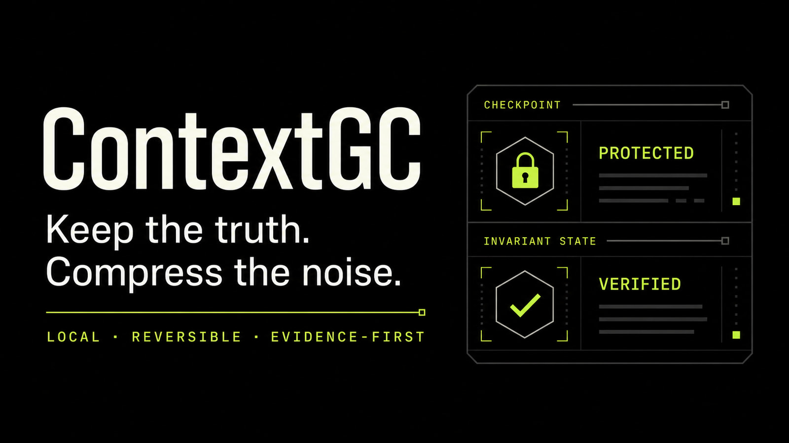

# ContextGC

**중요한 사실은 지키고, 소음은 압축합니다.**

[English](README.md) | [한국어](README.ko.md)



ContextGC는 긴 Codex 엔지니어링 작업을 위한 로컬 지속화 기반의 가역적
컨텍스트 제어 계층입니다. 정확히 보존해야 하는 목표와 제약을 typed
invariant로 보호하고, 근거를 해시로 보관하며, 압축 또는 새 세션 이후 작은
Task Frame으로 작업을 복구합니다. 여기서 가역성은 검증된 Task Frame
checkpoint 선택과 보관 근거의 rehydrate를 뜻하며, redaction된 원문, Git,
파일, 명령이나 외부 부작용을 되돌린다는 뜻이 아닙니다. Codex turn에 주입된
Task Frame은 사용자의 일반 Codex 서비스 경계에서 처리되므로 로컬 지속화가
오프라인 모델 실행을 의미하지도 않습니다.

OpenAI Build Week의 Developer Tools 프로젝트입니다.

## 왜 만들었나

숙련된 Codex 사용자는 보통 `PROJECT_STATE.md`에 작업 상태를 기록하고,
컨텍스트가 일정 수준을 넘으면 `/compact`를 실행하거나 새 세션으로 이동합니다.
좋은 습관이지만 컨텍스트가 가장 복잡한 순간에 사용자가 직접 다음을 수행해야
합니다.

- 목표와 금지사항을 빠짐없이 다시 적기
- 정확한 버전, 경로, 명령과 테스트 결과 유지하기
- 이미 실패한 접근과 미해결 blocker 구분하기
- 새 세션에서 어떤 문서를 다시 읽힐지 선택하기

ContextGC는 Markdown 기록을 없애지 않습니다. 그 위에 다음과 같은 검증 계층을
추가합니다.

- 목표, 제약, 정확한 식별자와 테스트 근거를 구조화합니다.
- `PreCompact`에서 checkpoint, snapshot, hook state를 모두 검증합니다.
- 근거를 로컬 archive에 해시로 저장하고 필요할 때만 rehydrate합니다.
- 새 세션의 `SessionStart`에서 검증된 작은 Task Frame을 주입합니다.
- 모델에는 로컬 절대경로 대신 opaque store ID만 제공합니다.

사용자가 얻는 핵심 효익은 긴 작업을 다시 설명하는 시간과 컨텍스트 누락으로
인한 재작업 위험을 줄이는 것입니다. 현재 버전은 실제 Codex credits 절감을
측정했다고 주장하지 않습니다.

## 심사위원을 위한 60초 공개 경로

1. [증거 탐색 데모](https://contextgc-build-week.trytrytry.chatgpt.site)에서
   synthetic receipt를 확인합니다. 2026-07-23 인증 없는 HTTP GET에서 `200`
   응답을 확인했지만 향후 hosting 가용성을 보장하지는 않습니다.
2. 정확한 [저장소 receipt](output/benchmark/benchmark-report.json)와 전체 hash
   `f7699823546f79657aea0faa290c0c648b8876236456f7a8ff02003875147ddd`를
   비교합니다.

선택적으로 Node.js 22.13 이상에서 고정된 release를 별도 빌드 없이
재현할 수 있습니다.

```powershell
git clone --branch v0.1.13 --depth 1 https://github.com/procloudkim/OpenAI-Build-Week-ContextGC.git context-gc
Set-Location context-gc
node scripts/contextgc.bundle.mjs simulate
```

Windows Codex에서 플러그인을 설치하려면 이어서 실행합니다.

```powershell
codex plugin marketplace add .
codex plugin add context-gc@context-gc-local
codex plugin list
```

새 Codex 스레드를 시작하고 `/hooks`를 엽니다. 표시된 hook 명령이 이 저장소의
`hooks/hooks.json`과 일치할 때만 신뢰하고 활성화합니다.

```text
Use ContextGC to inspect this task's context health and create a reversible
checkpoint. Keep exact constraints protected and explain every externalization.
```

자세한 설치와 복구 절차는 [한국어 사용자 매뉴얼](docs/user-manual.ko.md),
영문 절차는 [English user manual](docs/user-manual.md)을 참고하십시오.

## 핵심 동작

ContextGC는 작업 정보를 세 가지로 분류합니다.

- `KEEP`: 목표, 금지사항, 정확한 값처럼 active context에 남겨야 하는 정보
- `SUMMARIZE`: 의미를 보존하는 범위에서 요약할 수 있는 정보
- `EXTERNALIZE`: 원문은 로컬 archive에 저장하고 ContentRef만 유지할 정보

`DROP`은 없습니다. protected 또는 exact 항목이 주입 예산을 초과하면 조용히
버리지 않고 실패를 알립니다.

```text
Codex hooks / replay trace
        |
        v
append-only ledger ---> sanitized SHA-256 archive
        |                         |
        v                         |
schema guard -> MemoryAtoms -> invariant gate -> optimizer
                                              |
                          KEEP / SUMMARIZE / EXTERNALIZE
                                              |
                                              v
                              TaskFrame + receipt + checkpoint
                                              |
                                  rehydrate / restore known ID
```

## 권장 숙련자 워크플로

사람이 읽는 장기 기록은 계속 Markdown으로 관리하고, 다음 lifecycle boundary를
넘어야 하는 현재 상태만 ContextGC에 맡기는 방식을 권장합니다.

```text
PROJECT_STATE.md      장기 이력과 사람의 결정
        |
        v
ContextGC Task Frame  현재 목표, exact 제약, blocker, 다음 행동
        |
        +--> 해시 검증 로컬 archive
        |
        v
native compact 또는 새 세션
        |
        v
SessionStart 복구 + 필요한 근거만 rehydrate
```

Markdown의 투명성과 이식성을 유지하면서, 자유 형식 handoff의 누락 위험을
줄일 수 있습니다.

## 현재 동작하는 기능

- skill, lifecycle hooks, MCP 도구 6개를 포함한 Codex 플러그인
- `KEEP | SUMMARIZE | EXTERNALIZE` 결정론적 optimizer
- protected/exact invariant와 secret redaction fail-closed gate
- 모델에 경로를 노출하지 않는 private-store inference
- SHA-256 content-addressed archive와 atomic checkpoint
- 제한된 selective rehydration과 명시적 checkpoint restore
- 버전 allowlist 기반 Codex transcript telemetry adapter
- 3개의 고정 software-engineering trace와 hidden deterministic oracle
- sanitized receipt를 보여주는 심사위원용 Sites 데모

## 보장하지 않는 것

ContextGC는 다음을 주장하지 않습니다.

- Codex의 암호화된 native compaction 상태를 검사하거나 대체
- 임의의 기존 Desktop/CLI thread에서 `/compact`를 직접 실행
- redaction된 secret 원문을 복원
- 모든 개인정보를 탐지하는 범용 PII scanner
- lossless, globally optimal 또는 최초의 context-memory 시스템
- token을 실제 ChatGPT/Codex credits로 변환
- Git, 파일, 명령 또는 외부 부작용 rollback

ContextGC는 native compaction을 시작하지 않습니다. 신뢰한 `PreCompact`
hook은 host가 시작한 automatic compaction에 대해 checkpoint, snapshot과
hook-state 무결성을 확인한 뒤 진행을 허용하거나 차단할 수 있습니다.

OpenAI는 ChatGPT 인증 Codex 사용량에 대한 결정론적 token-to-credit 환산식을
공개하지 않았습니다. ContextGC는 raw token 범주와 명시적 usage proxy를
구분하고 `codexCredits: null`을 유지합니다.

지속화 전 deterministic redaction이 exact 보존보다 우선합니다. protected
exact 값이 redaction되면 원래 bytes는 checkpoint에서 복구할 수 없고, 해당
source는 protected exact EXTERNALIZE 대상으로 취급할 수 없습니다.

### Codex memory와의 공존

Codex가 관리하는 memory와 ContextGC는 서로 다른 계층입니다. Native memory는
여러 대화에 걸친 참고용 회상이고, ContextGC는 compaction 전후의 제한된
Task Frame과 무결성이 검증된 근거 포인터를 보존합니다. ContextGC는 native
memory를 읽거나 수정·중복 제거하지 않으며 checkpoint 근거로 신뢰하지도
않습니다. Codex memory나 모델이 업데이트되면 회상된 지침이 현재 저장소 및
최신 검증 Task Frame과 충돌하지 않는지 확인하십시오.

## 검증된 synthetic benchmark

모든 정책은 같은 세 개의 고정 trace를 실행하고 hidden deterministic oracle로
성공 여부를 판정합니다.

| 정책 | UPVS ↓ | 검증 성공 | Critical retention | 수동 개입 |
| --- | ---: | ---: | ---: | ---: |
| 고정된 수동 schedule | **59,884.67** | 3/3 | 100% | 6 |
| 75% 고정 임계값 + cooldown | 67,653.67 | 3/3 | 100% | 0 |
| ContextGC adaptive | 65,488.33 | 3/3 | 100% | 0 |

Adaptive UPVS는 fixed보다 3.20% 낮지만 manual보다 9.36% 높습니다. 따라서
15%-versus-both 경제성 promotion gate는 통과하지 못했습니다. 이 결과는
ContextGC를 토큰 절약 우승자가 아니라 safety/audit controller로 배치합니다.
실제 native compaction 품질이나 production savings의 증거가 아닙니다.

- [전체 benchmark receipt](output/benchmark/benchmark-report.json)
- [웹 공개용 receipt](output/benchmark/demo-receipt.json)

## 설치와 지원 범위

- 검증 플랫폼: Windows PowerShell
- Node.js: 22.13 이상
- 설치·lifecycle 검증에 사용한 Codex CLI: 0.145.0
- transcript telemetry allowlist: Codex `0.144.x`, `0.145.0-alpha.x`, 정확히
  `0.145.0` stable

`v0.1.13` tag가 검토한 source를 고정합니다. prebuilt bundle이나 hook을
신뢰하기 전에 [release hash manifest](release/v0.1.13.sha256)를 확인하십시오.
`/hooks`와 clone의 일치는 명령 parity를 확인하고, tag와 manifest는 검토한
source와 bytes를 식별합니다.

플러그인 설치만으로 bundled hook이 신뢰되지는 않습니다. 설치 또는 업데이트 후
새 thread를 시작하고 `/hooks`에서 정의를 검토하십시오.

정상 설치에서는 모든 MCP 호출에서 `dataDir`를 생략합니다. ContextGC가
플러그인 전용 local store를 선택합니다. 주입된 Task Frame은 같은 digest를
`contextgcStoreId`로 표시하고 MCP structured result는 `storeId`로 표시합니다.
둘 다 경로나 권한 token이 아닌 opaque correlation 값입니다.

## MCP와 CLI

MCP 도구:

- `contextgc_status`
- `contextgc_plan`
- `contextgc_archive`
- `contextgc_checkpoint`
- `contextgc_rehydrate`
- `contextgc_restore`

빌드 없이 실행 가능한 CLI:

```text
node scripts/contextgc.bundle.mjs status
node scripts/contextgc.bundle.mjs simulate
node scripts/contextgc.bundle.mjs checkpoint --frame <file-or-stdin>
node scripts/contextgc.bundle.mjs restore <checkpoint-id>
node scripts/contextgc.bundle.mjs report
```

## 소스 빌드와 검증

```powershell
npm ci --ignore-scripts
npm --prefix site ci --ignore-scripts
npm run verify
```

`verify`는 TypeScript build, 테스트, deterministic benchmark 재생성, CLI/MCP
bundle 생성, marketplace plugin staging, Sites lint·render·test를 수행합니다.

## Codex와 GPT-5.6을 사용한 방식

Codex with GPT-5.6은 다음 과정에 사용됐습니다.

- 핵심 구현과 통합
- OpenAI 공식 문서 확인
- 상반된 주장과 개인정보 경계 검토
- fixture와 테스트 생성
- benchmark 및 release artifact 검증

제품 실행 중에는 lifecycle boundary에서 active Codex model에 구조화된 Task
Frame을 요청할 수 있습니다. 이후 schema 검증, action 선택, archive,
checkpoint와 synthetic 평가 결과는 결정론적 코드가 담당합니다. benchmark에는
model-as-judge가 없습니다.

Build Week의 primary `/feedback` Session ID는 Devpost UI에만 입력하며 이
저장소, 영상, issue 또는 문서에 기록하지 않습니다.

## 프로젝트 기록과 제출 자료

- [프로젝트 일대기](docs/project-journey.ko.md)
- [영문 프로젝트 일대기](docs/project-journey.md)
- [Devpost 초안](submission/devpost-draft.md)
- [3분 데모 스크립트](submission/demo-script.md)
- [심사위원 가이드](submission/judge-guide.md)
- [최종 제출 런북](submission/final-submission-runbook.md)
- [증거 체크리스트](submission/evidence-checklist.md)

## 문서 지도

| 목적 | 문서 |
| --- | --- |
| 한국어 설치·운영·복구 | [한국어 사용자 매뉴얼](docs/user-manual.ko.md) |
| 영문 설치·운영·복구 | [English user manual](docs/user-manual.md) |
| 오류 해결 | [Troubleshooting](docs/troubleshooting.md) |
| MCP, CLI, schema 확인 | [Interface reference](docs/reference.md) |
| 구조 이해 | [Architecture](docs/architecture.md) |
| 보안과 개인정보 경계 | [Security and privacy](docs/security-and-privacy.md) |
| 개발과 릴리스 | [Developer guide](docs/developer-guide.md) |
| 기여와 보안 신고 | [CONTRIBUTING](CONTRIBUTING.md), [SECURITY](SECURITY.md) |

## 라이선스

ContextGC는 MIT License로 공개됩니다. [LICENSE](LICENSE)와 번들에 적용되는
[third-party notices](THIRD_PARTY_NOTICES.md)를 참고하십시오.
